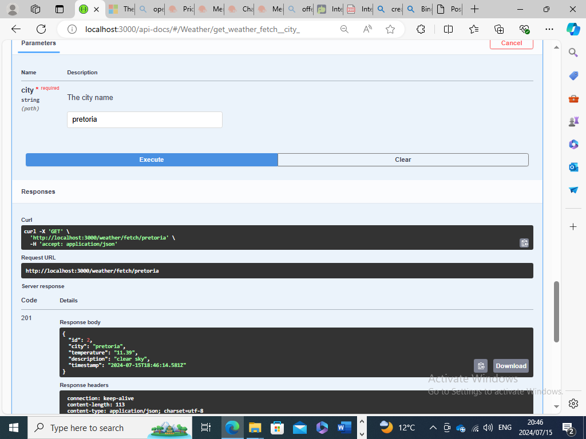
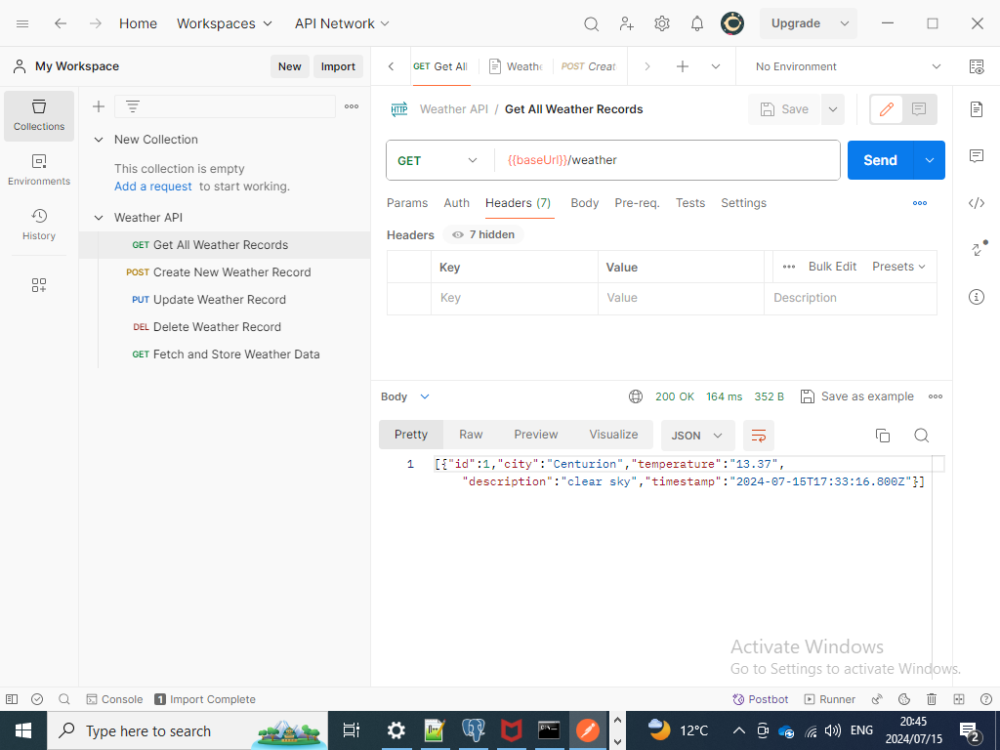

# Weather API

This API allows you to fetch and manage weather data from the OpenWeatherMap API.

Database: [postgresql](https://www.postgresql.org/download/linux/ubuntu/)  
Test API tool:[Postman](https://www.postman.com/downloads/)  
Simplify API development:[Swagger](https://swagger.io/)  
[HTTP status code](https://developer.mozilla.org/en-US/docs/Web/HTTP/Status)  
  
### how to use  
$ npm install  
$ npm start  
$ node index.js

## Features:
- Fetch current weather data for a specific city and store it in a local database.
- Perform CRUD operations on the stored weather data.
- Endpoints are documented and can be tested using Swagger UI.

## Endpoints:
- `GET /weather`: Retrieve all weather records.
- `POST /weather`: Create a new weather record.
- `PUT /weather/:id`: Update an existing weather record.
- `DELETE /weather/:id`: Delete a weather record.
- `GET /weather/fetch/:city`: Fetch and store weather data for a specific city.

## Setup and Run

### Prerequisites

- Node.js (version 14 or later)
- PostgreSQL database

### Demo: 
Node.js REST API using Swagger
  
  
Node.js REST API using Postman 
  